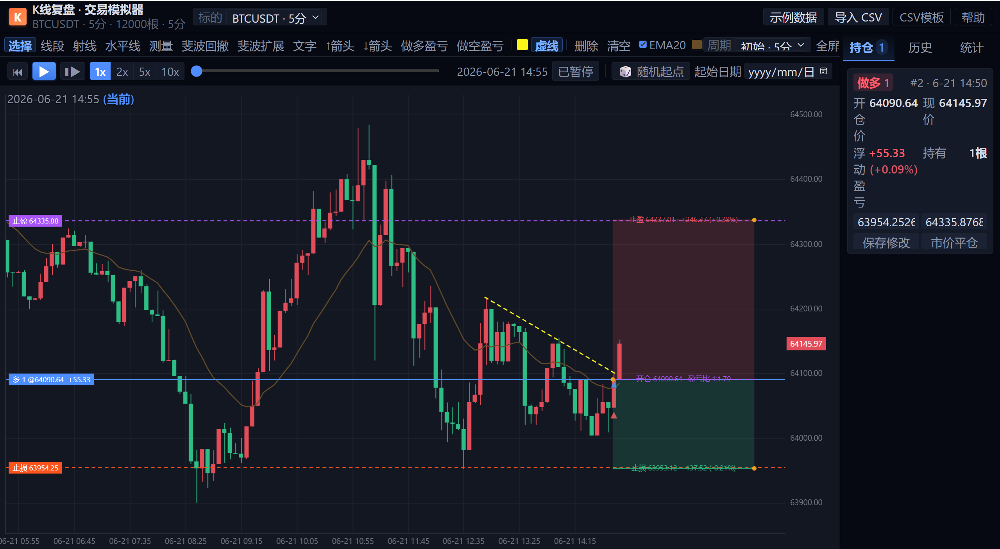
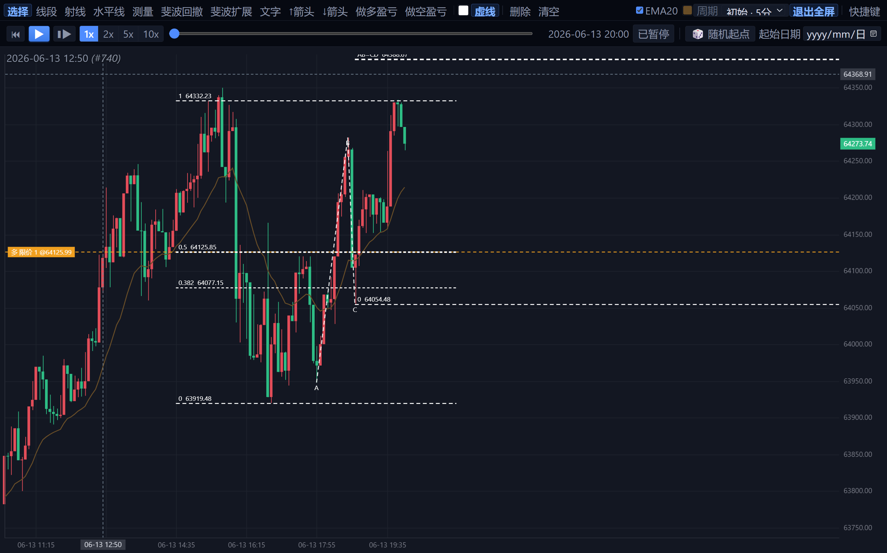

# Kline Replay Trainer · K线回放模拟训练器

纯前端（零依赖、零后端）的**行情复盘训练工具**：载入历史 K 线后逐根「重演」，在**看不到未来**的环境里练习下单、设止盈止损与画线分析。平仓自动记入历史档案，可随时回看每笔交易的进出场 K 线波段并写下复盘笔记。

> 双击 `index.html` 即可在浏览器运行，无需安装任何依赖。

## 功能特性

- **逐根回放，拒绝偷看**：空格键/播放键每次只前进一根 K 线（不提供「上一根」），随机起点、进度条跳转，可向回拖拽并自动回滚交易状态。
- **内置数据 + 自由导入**：内置 BTCUSDT / XAU / ES500 三品种 5 分钟示例行情；支持拖入 / 选择 CSV 文件导入自己的数据；多周期一键换算（5分 / 1时 / 1日…）。
- **快捷下单（固定 1 手）**：图表右键按鼠标价位挂 **限价 / 突破** 单；右键点在挂单线上可直接**撤销该挂单**；键盘 `B` 多 / `S` 空 / `C` 全平。
- **可视化改单与止盈止损**：直接拖动挂单线改价；开仓后上下拖动开仓线即可分别设置止盈 / 止损，触发后自动平仓并标注盈亏比。
- **全套画线分析**：水平线、趋势线、射线、测量、斐波回撤、斐波扩展、文字标注 —— 统一「两段式点击」交互（单击起点、再击确认；拖拽不成图）。
- **历史复盘**：每笔平仓自动记录方向、开平价格与时间、盈亏；点击记录可跳回当时的 K 线，图表标注进出场位置并用连线还原操作路径，支持文字备注，数据保存在浏览器本地。
- **全屏专注 + 完整快捷键**（`?` 随时查看键盘帮助）。

## 示例截图

### 盈亏交易（含止盈止损、自动连线与盈亏比）
多单开仓后，左右拖动开仓线即可分别设置**止盈**（上红线）与**止损**（下绿线）；触发后自动平仓，标注「盈亏比 1:0.92」，并用红色三角 / 绿色叉号还原进出场位置。



### 画线分析（斐波回撤 + 水平线 + 箭头 + 测量）
工具栏一键切换「线段 / 水平线 / 测量 / 斐波回撤 / 斐波扩展 / 文字 / 箭头 / 做多盈亏」。所有画线工具统一「单击起点 → 再次点击确认」交互，按住拖拽不成图。



## 快速开始

1. 双击项目根目录的 `index.html`，在浏览器中打开即用；
2. 或用任意静态服务器（可选）：
   ```bash
   python -m http.server 8080    # 然后访问 http://localhost:8080
   ```

## 回归测试（可选）

项目附带 Node 无头回归测试（VM 沙箱 + DOM 桩，无需浏览器）：

```bash
node test_runtime.js   # 全部通过
```

## 使用说明

详细的图文操作手册见 [使用说明.md](./使用说明.md)。

## 目录结构

```
├── index.html          # 入口页面
├── css/style.css       # 样式
├── js/
│   ├── app.js          # 应用状态机 / 事件 / 回放 / 菜单
│   ├── chart.js        # 图表渲染 / 缩放平移 / 坐标换算
│   ├── drawings.js     # 画线工具与盈亏线渲染
│   ├── trading.js      # 撮合引擎（市价 / 限价 / Stop）
│   └── data.js         # 数据工具（CSV 解析 / 周期聚合 / 随机数据）
├── data/               # 内置示例行情（已裁剪为轻量示例）
├── docs/
│   └── screenshots/    # README 引用的示例截图
├── test_runtime.js     # Node 回归测试
└── 使用说明.md
```

## 数据说明

为控制仓库体积，`data/` 内置的三个品种仅保留**最近约 6 周（各 12,000 根 5 分钟 K 线）**作为可运行示例；日常使用请用「导入 CSV」载入你自己的完整历史数据。

## 开源协议

[MIT](./LICENSE) © 2026 xiumu250-blip
